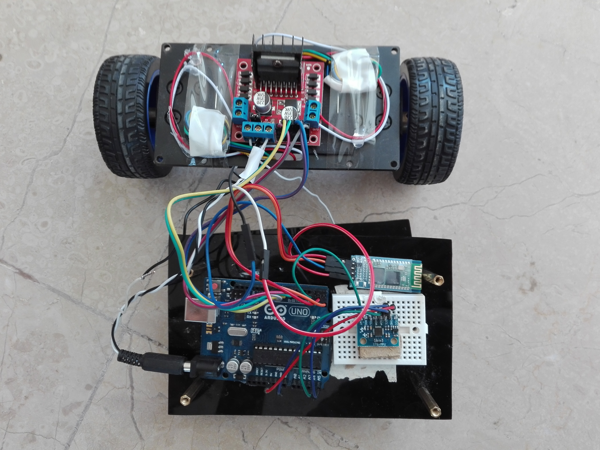

# Self-Balancing-Robot

A two wheel self-balancing robot is an important kind of mobile robots. Balancing robots means the
capability of the robot to balance on its two wheels without falling. The inverted pendulum system, unlike
many other control systems is naturally unstable. Therefore, the system has to be controlled to reach
stability in this unstable state. A two wheeled balancing robot is simply an inverted pendulum system
which stands upright on two wheels.

The research of two wheeled balancing robots has increased in recent years due to the invention
of human transporter application, Segway. This particular project consists of the modeling of the robot,
design a Proportional-Integral-Derivative controller and implement the controller on the two-wheeled
robot.

### Project Working Demo

https://youtu.be/ffqZD3UXBxw

https://youtu.be/oGdkGJNOk5g

https://youtu.be/iP7hlrpBZ1o
